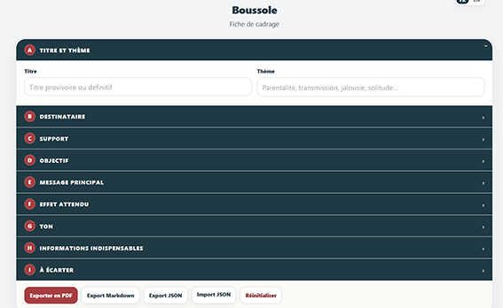
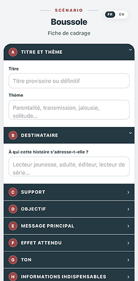
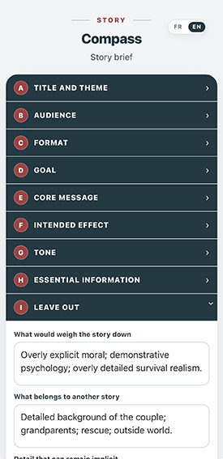
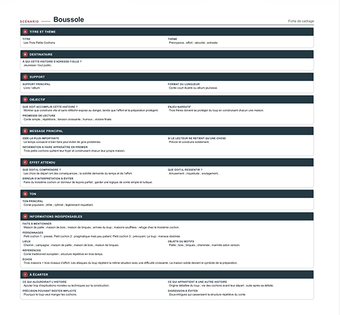

# Boussole

**Version 1.0.0 — 1er août 2026**

Application web bilingue pour **cartographier les intentions d’un projet de bande dessinée et garder le cap pendant l’écriture**.

**Boussole** permet de définir rapidement le cadre d’une histoire : titre et thème, destinataire, support, objectif, message principal, effet attendu, ton, informations indispensables et éléments à écarter.

Le programme est conçu et développé par **Simon Léturgie** dans le cadre d’**Eigrutel BD Academy** et d’**Eigrutel Lab — Atelier d’outils libres pour la bande dessinée**.

---

## Aperçu

### Interface française — ordinateur



### Interface française — mobile



### English interface — mobile



### Impression / PDF



---

## Français

### Présentation

**Boussole** est une application web autonome réunie dans un unique fichier HTML.

Elle sert à poser clairement les intentions d’un projet avant ou pendant l’écriture afin de ne pas perdre de vue ce que l’histoire cherche à accomplir.

L’interface est affichée en **français par défaut** lors de la première ouverture. Un switch discret permet de passer à l’anglais. La langue choisie est ensuite mémorisée dans le navigateur.

Le programme peut être utilisé sur ordinateur, tablette ou téléphone avec un navigateur web moderne.

### Rubriques

La fiche est organisée en neuf sections :

- **A — Titre et thème**
- **B — Destinataire**
- **C — Support**
- **D — Objectif**
- **E — Message principal**
- **F — Effet attendu**
- **G — Ton**
- **H — Informations indispensables**
- **I — À écarter**

Chaque section peut être ouverte ou repliée indépendamment.

### Fonctionnalités

- interface bilingue français–anglais ;
- français utilisé par défaut ;
- mémorisation locale de la langue choisie ;
- sections repliables ;
- adaptation automatique de la hauteur des champs de texte ;
- sauvegarde automatique des données dans le navigateur ;
- mémorisation de l’état ouvert ou fermé des sections ;
- export de la fiche au format **JSON** ;
- import d’une fiche JSON ;
- export au format **Markdown** ;
- mise en page spécifique pour l’impression et l’enregistrement en **PDF** ;
- interface responsive pour ordinateur, tablette et téléphone ;
- fonctionnement dans un fichier HTML autonome ;
- code commenté en français et en anglais.

### Installation et lancement

Aucune installation n’est nécessaire.

1. Téléchargez le fichier `boussole.html`.
2. Conservez-le dans le dossier de votre choix.
3. Ouvrez-le avec un navigateur web moderne.

Le programme peut également être utilisé directement avec GitHub Pages :

[Ouvrir Boussole](https://eigrutel.github.io/eigrutel-boussole/boussole.html)

### Utilisation

1. Donnez un titre provisoire ou définitif au projet.
2. Notez le thème principal.
3. Définissez à qui l’histoire s’adresse et sur quel support elle est pensée.
4. Précisez ce qu’elle doit accomplir, son enjeu et sa promesse de lecture.
5. Formulez le message ou l’idée essentielle.
6. Déterminez ce que le lecteur doit comprendre ou ressentir.
7. Fixez le ton.
8. Rassemblez les faits, personnages, lieux, objets, références et échos indispensables.
9. Notez enfin ce qui doit rester hors du projet afin d’éviter les digressions.

Les données sont enregistrées automatiquement dans le stockage local du navigateur.

### Sauvegarde JSON

Le bouton **Export JSON** crée une copie portable de la fiche.

Le bouton **Import JSON** permet de restaurer une fiche précédemment enregistrée ou de la transférer vers un autre appareil ou navigateur.

L’export JSON est recommandé pour conserver une sauvegarde indépendante du stockage du navigateur.

### Export Markdown

Le bouton **Export Markdown** produit un fichier texte structuré reprenant l’ensemble des rubriques et leur contenu.

Ce fichier peut être ouvert dans un éditeur de texte, un logiciel de prise de notes ou toute application compatible avec Markdown.

### Impression et PDF

Le bouton **Exporter en PDF** ouvre la fonction d’impression du navigateur.

La mise en page imprimée est distincte de l’interface à l’écran et organise les différentes rubriques sous la forme d’une fiche synthétique.

Pour produire un PDF :

1. cliquez sur **Exporter en PDF** ;
2. choisissez l’option d’enregistrement en PDF proposée par votre navigateur ou votre système ;
3. vérifiez l’aperçu avant validation.

### Vie privée

Boussole ne nécessite aucun compte utilisateur.

Les informations saisies sont conservées localement dans le navigateur. Le programme ne prévoit aucune transmission des données vers un serveur.

L’utilisateur choisit lui-même les fichiers qu’il exporte ou partage.

### Compatibilité

Boussole est conçu pour les versions récentes des principaux navigateurs :

- Firefox ;
- Chromium et Google Chrome ;
- Microsoft Edge ;
- Safari sur macOS, iPadOS et iOS.

Les comportements d’impression, de téléchargement et de stockage local peuvent légèrement varier selon le navigateur et le système.

### Structure technique

Le programme principal est contenu dans un fichier unique :

```text
boussole.html
```

Ce fichier regroupe :

- la structure HTML ;
- la feuille de style CSS ;
- le code JavaScript ;
- les textes français et anglais ;
- la gestion du stockage local ;
- les exports ;
- la mise en page d’impression.

Aucune installation côté serveur n’est nécessaire.

### Structure recommandée du dépôt

```text
eigrutel-boussole/
├── boussole.html
├── index.html
├── README.md
├── NOTICE.md
├── LICENSE.md
├── CHANGELOG.md
├── ARCHITECTURE.md
├── favicon/
│   └── fav14.png
└── docs/
    └── images/
        ├── boussole-desktop-fr.png
        ├── boussole-mobile-fr.png
        ├── boussole-en.png
        └── boussole-pdf.png
```

---

## English

### Overview

**Boussole / Compass** is a self-contained bilingual web application designed to map the intentions behind a comics project and help the author stay on course while writing.

It provides a compact story brief covering the project’s theme, audience, format, goal, core message, intended effect, tone, essential information and elements to leave out.

The interface opens in **French by default**. A discreet language switch changes it to English, and the selected language is remembered by the browser.

### Sections

The worksheet is divided into nine sections:

- **A — Title and theme**
- **B — Audience**
- **C — Format**
- **D — Goal**
- **E — Core message**
- **F — Intended effect**
- **G — Tone**
- **H — Essential information**
- **I — Leave out**

Each section can be expanded or collapsed independently.

### Features

- bilingual French–English interface;
- French selected by default;
- browser-based language preference;
- collapsible sections;
- automatic textarea resizing;
- automatic local saving;
- stored open / closed section state;
- JSON export and import;
- Markdown export;
- dedicated print / PDF layout;
- responsive interface for desktop, tablet and phone;
- standalone HTML distribution;
- source-code comments in French and English.

### Installation

No installation is required.

1. Download `boussole.html`.
2. Store it wherever you want.
3. Open it in a modern web browser.

The application is also available through GitHub Pages:

[Open Boussole](https://eigrutel.github.io/eigrutel-boussole/boussole.html)

### Local data

The application stores the current worksheet in the browser’s local storage.

This data:

- remains on the device and browser being used;
- is not automatically sent to a server;
- may disappear if browser storage is cleared;
- is not automatically synchronized between devices.

For long-term storage or transfer, use the **JSON export**.

### Markdown export

The Markdown export creates a structured text file containing all sections and their contents.

It can be opened in text editors, note-taking applications and other Markdown-compatible software.

### Print and PDF

The **Export PDF** button opens the browser print dialog.

A dedicated print layout turns the current project into a compact story-brief sheet that can be printed or saved as PDF.

### Compatibility

Boussole is designed for recent versions of:

- Firefox;
- Chromium and Google Chrome;
- Microsoft Edge;
- Safari on macOS, iPadOS and iOS.

Printing, downloading and local-storage behaviour may vary slightly between browsers and operating systems.

---

## Version

**Stable version: 1.0.0**  
**Date: 1 August 2026**

## Auteur / Author

**Simon Léturgie**  
Eigrutel BD Academy  
Eigrutel Lab — Atelier d’outils libres pour la bande dessinée

Site : [stripmee.com](https://www.stripmee.com)

## Licences

- **Code source / Source code:** GNU Affero General Public License v3.0 or later.
- **Documentation et modèles / Documentation and templates:** Creative Commons Attribution-ShareAlike 4.0 International, unless otherwise stated.
- **Marques, logos et signes distinctifs / Trademarks, logos and distinctive signs:** Eigrutel, Eigrutel Lab and Eigrutel BD Academy are reserved.

See `LICENSE.md` and `NOTICE.md` for detailed licence and attribution information.
